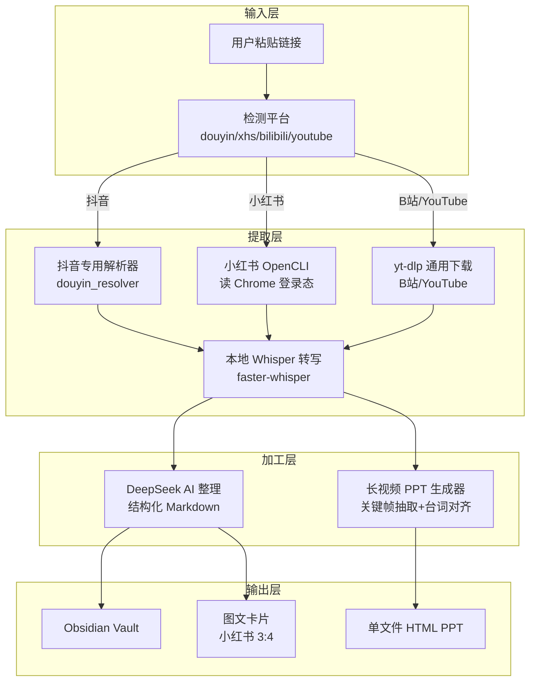
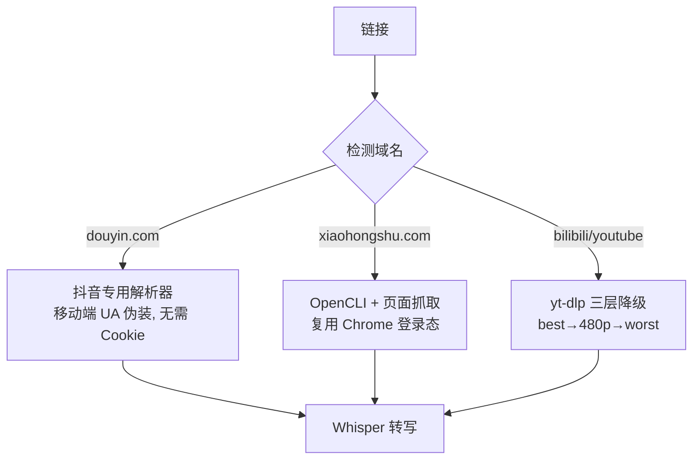

# 架构图 · Unified Video Tool

## 整体架构

## 平台路由决策

## 关键架构决策

| 决策 | 原因 | 位置 |
|------|------|------|
| 抖音走专用解析器 | yt-dlp 对抖音需要 Cookie，被 Chrome 锁读不到；专用解析器用移动端 UA 无需登录 | `server.py process_douyin` |
| 小红书走 OpenCLI | 页面 SSR JSON 有转义问题 parse 失败；OpenCLI 直接读 Chrome 登录态最稳 | `server.py process_xiaohongshu` |
| 三层下载降级 | B站非会员无 1080p 权限，写死 best 会失败；best→480p→worst 兜底 | `server.py process_other` |
| URL 清理 xsec_token | CMD 会把 `&` 当命令分隔符；只保留 xsec_token 参数 | `server.py _xhs_clean_url` |
| 字幕优先 Whisper 兜底 | 有字幕直接读，没字幕才跑本地 Whisper，省时间 | `server.py process_other` |
