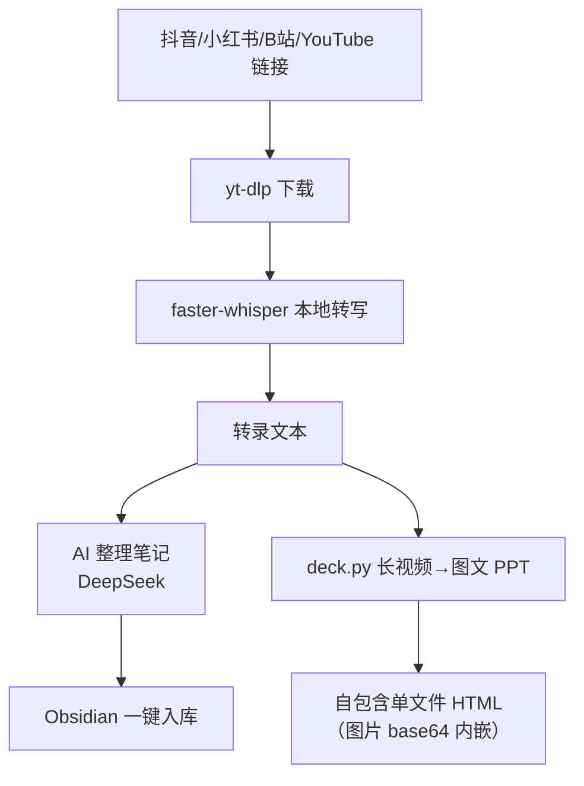

# 视频文案提取 + 长视频图文 PPT

> 粘贴抖音 / 小红书 / B站 / YouTube 链接 → 本地一键提取文案；长视频一键生成「关键帧 + 原话」图文 PPT

[](https://python.org)
[](https://github.com/SYSTRAN/faster-whisper)
[](https://deepseek.com)

---

## 📌 Problem（背景与问题）

刷到一条短视频/长视频，想把**文案抠下来**做笔记、写小红书、整理资料，通常会遇到：

- 平台不给你文案，得手动逐字敲
- 长视频几十个金句，截图 + 摘录要花一晚上
- 想转成可分享的图文，还得自己排版

**目标**：一个本地工具，粘贴链接就完事——文案提取、笔记整理、图文 PPT 全自动。

## 🤖 Why This（为什么这么做，而不是用现成服务）

| 方案 | 问题 |
|------|------|
| 付费转写 API（如讯飞/腾讯） | 按分钟计费，长视频成本高，还要上传到别人服务器 |
| 现成图文生成工具 | 不能定制皮肤，导出不可控 |
| **本地 faster-whisper** | 免费、本地跑、隐私安全，只依赖你电脑的算力 |

所以核心决策是：**转写走本地，AI 整理走 DeepSeek，成品是可分享的单文件 HTML**——不锁进任何平台。

## 🏗️ Architecture（架构）



## 🛠️ Skills（核心能力）

- **多平台文案提取**：抖音、小红书、B站、YouTube（本地下载 + faster-whisper 转写，不依赖付费 API）
- **小红书图文笔记**：标题/作者/正文提取，视频语音自动补转写
- **AI 整理笔记**：转录文本 → 结构化 Markdown（DeepSeek / 任何 OpenAI 兼容 API）
- **Obsidian 一键入库**：直接存到 Vault 指定文件夹
- **笔记生图**：笔记文本 → 小红书 3:4 图文卡片，三套样式，可配 AI 生图封面
- **长视频 → 图文 PPT**：
  - 关键帧自动抽取（灰度签名去重，跳过重复画面）
  - 台词按时间轴对齐到每一页
  - 「原文」/「AI 改版」双模式 + 深色/浅色两套皮肤

## 🧰 Tools（技术栈）

- `yt-dlp`（下载）· `faster-whisper`（本地转写）· `zhconv`（繁简转换）· `ffmpeg`
- DeepSeek / OpenAI 兼容 API（笔记整理、改版、生图封面）
- 皮肤 Token 化：`tastes/<theme>/tokens.json`，改色/字体/圆角即定制

## 🧠 Memory（状态 / 去重 / 持久化）

- **关键帧去重**：灰度签名比对，记住「已经抓过的画面」，避免几十页重复截图
- **时间轴对齐**：台词按时间戳绑定到对应帧，保证「图对上话」
- **本地持久化**：成品是 base64 内嵌的单文件 HTML，可发给任何人、离线打开

## 📊 Eval（评估 / 验证）

- 多平台链接实测通过（抖音/小红书/B站/YouTube）
- 关键帧去重后，长视频页面数显著压缩，不重复
- 单文件 HTML 在无网络环境下可正常翻页浏览

## 💥 Failure Cases（失败案例 / 边界）

| 失败场景 | 表现 | 解法 |
|---------|------|------|
| 抖音解析后端不稳定 | 单平台提取失败 | 复用 `obsidian-content-capture-backend`，且 `DOUYIN_BACKEND` 可替换 |
| 长视频关键帧大量重复 | PPT 页面冗余 | 灰度签名去重 |
| 未配置生图 Key | 封面生成失败 | 自动降级 CSS 卡片 + emoji 兜底 |
| ffmpeg 未装 / 不在 PATH | 转写失败 | 启动前校验 + 文档明确安装步骤 |

## 🎨 Design Decisions（设计决策）

| 决策 | 理由 | 代价 |
|------|------|------|
| 本地转写而非付费 API | 免费 + 隐私 + 不限量 | 依赖本机算力 |
| 成品单文件 HTML（base64 内嵌） | 可分享、离线可看、不依赖服务器 | 文件体积大 |
| 皮肤 Token 化 | 改外观不改代码 | 需维护 token 规范 |
| 关键帧灰度签名去重 | 简单、快、够用 | 对相似但不同的画面可能误去重 |

## 🚀 快速开始

```bash
pip install yt-dlp faster-whisper zhconv
# 装 ffmpeg 并加入 PATH
copy .env.example .env    # 填 LLM_API_KEY 与 OBSIDIAN_VAULT
python server.py          # http://127.0.0.1:5051
```

---

*这是我把「多个痛点」收敛成一个工具的项目：下载、转写、整理、入库、生图、成 PPT，一条链走通。*
